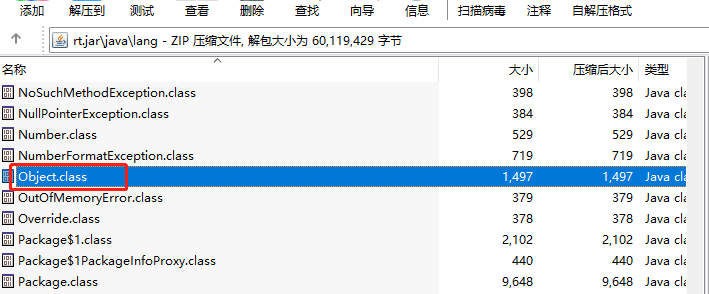

# jvm设计加载过程

## 一、使用cmd读取控制台指令

## 二、使用三种方式去加载 class文件（最终目的转成二进制流）
1. 通过获取bootstrap加载方式加载的目录下的class，即java环境的jre目录下的 lib 目录下的字节码文件；
可以自己打开自己jdk的安装目录；
   
   
这里面会记录所有由bootstrap加载的包：我们不妨看看**rt.jar**通过压缩工具提取后的东西

所以我们只需要使用命令：
```shell
create-jvm -Xjre D:\java\jdk\jre java.lang.Object
```
这样就可以获取到Object类的二进制文件

2. 通过etx加载方式，则是再 lib下的 ext目录下，加载原理类似

3. 通过应用程序加载方式加载的字节码，需要我们自己指定字节码所在的位置
```shell
create-jvm.exe -Xjre D:\java\jdk\jre  -classpath D:\golang\source\bin\create-jvm\bin\java\ Demo
```
其中jre会自动从环境变量中读取，所以可以不用自己配置

## 三、解读字节码文件，就是将字节数据，转换成jvm规范中的ClassFile文件格式

## 四、栈相关的操作，其中由线程私有、栈、栈帧、局部变量表、操作数栈等概念

## 五、指令篇
这里是通过各种字节码操作指令 + 局部变量表 + 操作数栈来完成一系列的方法调用过程